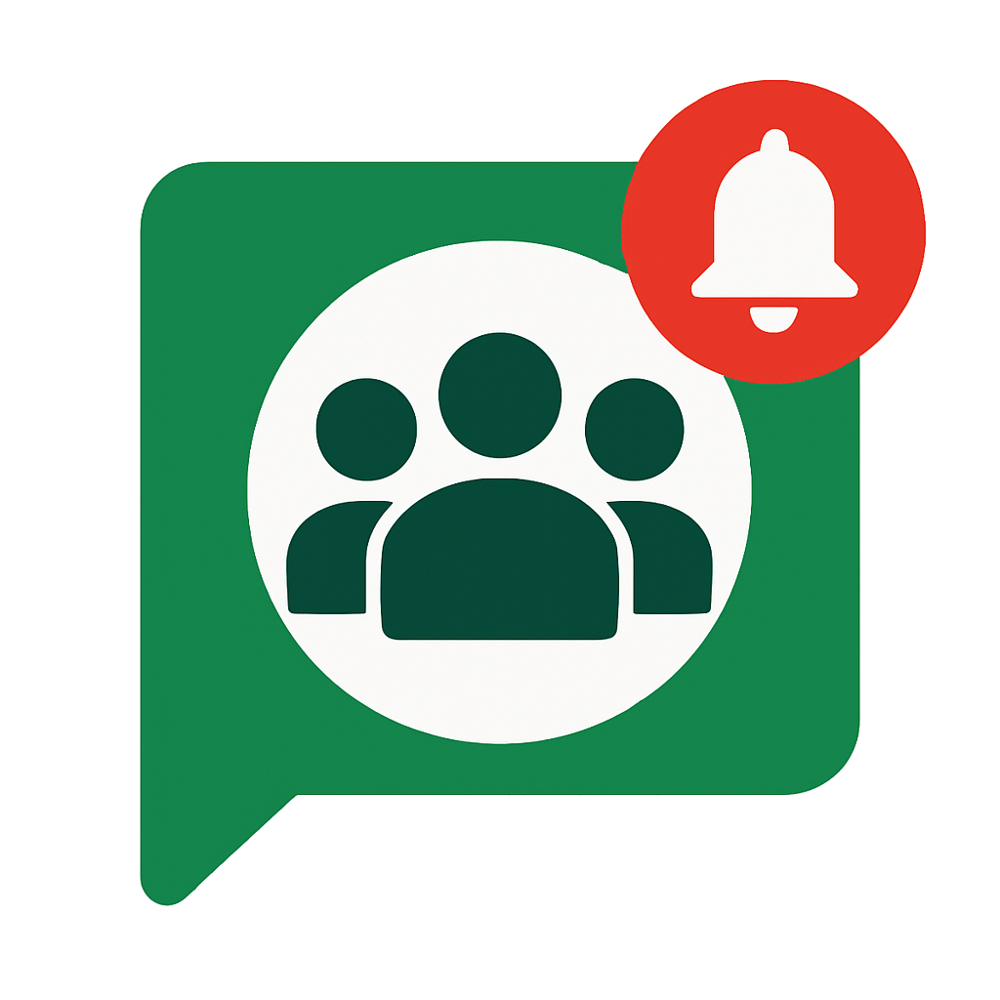

# Google Meet Reminder

A Chrome extension that ensures you never miss a Google Meet call with powerful notification features.



## Features

### Powerful Notification System
- **Unmissable Visual Alerts**: Modern black background with fluid aurora animation and interactive orb-based join button
- **Continuous Audio Alerts**: Plays your selected ringtone until you take action
- **Persistent Notifications**: Stays on screen until you join or decline the meeting
- **One-Click Join**: Instantly join your Google Meet with a single click

### Early Notification System
- **Advance Warnings**: Get notified 5, 10, or 15 minutes before your meeting starts
- **Meeting Agenda**: View meeting details and agenda in early notifications
- **Configurable Intervals**: Enable or disable notifications at each interval
- **Sound Options**: Configure which intervals play sounds

### Snooze Functionality
- **Customizable Durations**: Snooze notifications for your preferred duration
- **Quick Access**: Easily snooze from the notification interface
- **Default Settings**: Set your preferred default snooze duration
- **Custom Presets**: Create and manage your own snooze duration presets

### Ringtone Customization
- **Multiple Built-in Options**: Choose from a variety of pre-installed ringtones
- **Custom Uploads**: Upload your own audio files (.mp3 or .ogg format)
- **Preview Functionality**: Listen to ringtones before selecting them
- **Per-Interval Settings**: Configure different sounds for different notification times

### Seamless Calendar Integration
- **Automatic Detection**: Automatically detects upcoming Google Meet calls
- **Real-time Updates**: Stays in sync with your Google Calendar
- **Meeting Details**: Displays meeting title, time, and organizer
- **Smart Link Extraction**: Works with various Google Meet URL formats

## Installation

1. Download the extension from the Chrome Web Store (link coming soon)
2. Click "Add to Chrome" to install the extension
3. Grant the necessary permissions for calendar access
4. The extension will automatically start monitoring your calendar for upcoming meetings

## Usage

### Basic Usage
- The extension runs in the background and automatically checks for upcoming meetings
- When a meeting is about to start, a notification will appear with options to join or decline
- Click the orb button to join the meeting or the red button to dismiss the notification

### Configuring Settings
1. Click the extension icon in your browser toolbar
2. Select "Settings" to access the options page
3. Configure your preferred ringtone, early notification intervals, and snooze durations
4. Click "Save Settings" to apply your changes

### Testing the Notification
1. Click the extension icon in your browser toolbar
2. Click "Test Notification" to see how the notification will appear
3. This allows you to test your selected ringtone and visual settings

## Privacy

This extension:
- Only accesses your Google Calendar data to detect upcoming meetings
- Does not store or transmit your calendar data to any third parties
- Requires minimal permissions to function properly
- All data is stored locally on your device

## Support

If you encounter any issues or have suggestions for improvements, please:
- Submit an issue on our GitHub repository
- Contact us at support@example.com

## License

This project is licensed under the MIT License - see the LICENSE file for details.

## Publishing to Chrome Web Store

If you want to publish this extension to the Chrome Web Store, follow these steps:

### Step 1: Prepare Your Extension Package

1. Create a ZIP file of your extension directory:
   ```bash
   zip -r google-meet-reminder.zip * -x "*.git*" -x "*.DS_Store"
   ```
   
2. Prepare promotional materials:
   - Store icon (128x128 PNG) - already included in assets/icons/
   - At least one screenshot (1280x800 or 640x400)
   - Optional: Small promotional image (440x280)
   - Optional: Large promotional image (920x680)

### Step 2: Create a Chrome Web Store Developer Account

1. Go to the [Chrome Web Store Developer Dashboard](https://chrome.google.com/webstore/devconsole/)
2. Sign in with your Google account
3. Pay the one-time developer registration fee ($5)
4. Complete your developer profile with required information

### Step 3: Submit Your Extension

1. Click "New Item" in the developer dashboard
2. Upload your ZIP file
3. Fill out the store listing information:
   - Extension name
   - Detailed description
   - Category selection (Productivity recommended)
   - Language
   - Upload promotional images and screenshots
4. Set distribution options (which countries)
5. Set pricing (free or paid)
6. Submit for review

### Step 4: Wait for Review

The review process typically takes a few business days. You'll receive email notifications about the status.

## Google Project ID Considerations

This extension uses a Google OAuth2 client ID for Google Calendar API access. The current client ID in the manifest.json file is:

```
"client_id": "372956210374-jupiu1btpbvgbj3lkej2i2siljsva8c7.apps.googleusercontent.com"
```

### Important Notes:
- **For Personal Use**: If you're using this extension for personal use only, the included client ID should work fine.
- **For Distribution**: If you plan to distribute this extension to others, you should:
  1. Create your own Google Cloud Project
  2. Enable the Google Calendar API
  3. Configure the OAuth consent screen
  4. Generate your own OAuth client ID
  5. Replace the client ID in manifest.json with your own
- **For Other Developers**: If you're forking this project, you should create your own Google Cloud Project and use your own client ID.

For detailed instructions on setting up a Google Cloud Project for Chrome extensions, see the [Google Identity documentation](https://developers.google.com/identity/protocols/oauth2/javascript-implicit-flow).