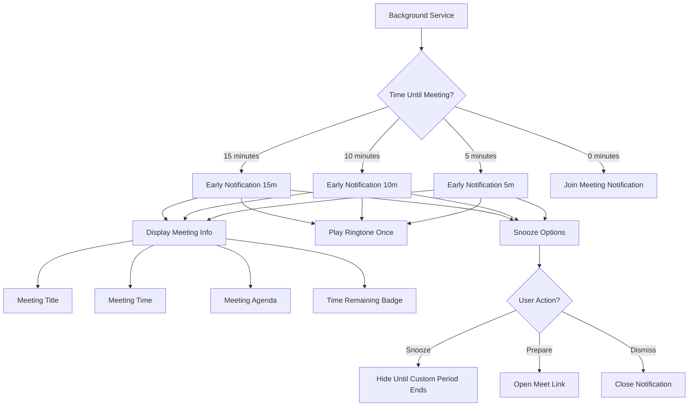
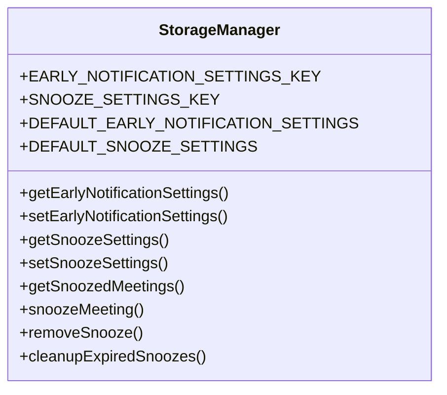
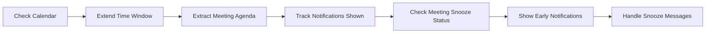
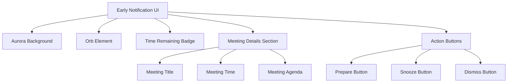
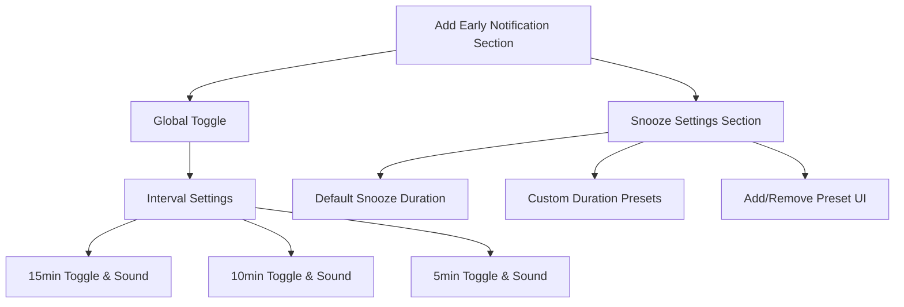
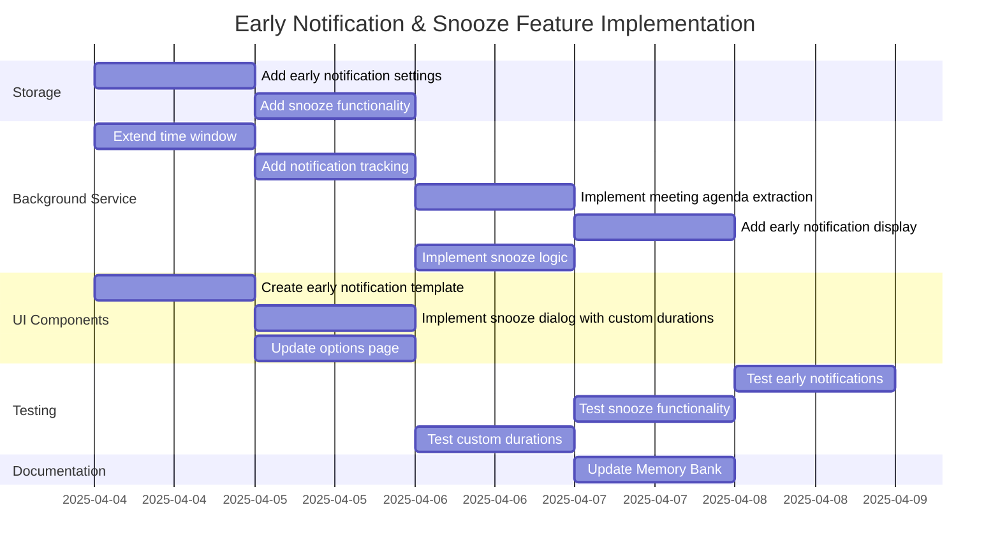

# Early Meeting Notification & Snooze Feature Implementation Plan

## Overview

This implementation plan details the addition of early notification and snooze functionality to the Google Meet Reminder extension. These features will enhance the user experience by:

1. Providing pre-meeting notifications (5/10/15 minutes before)
2. Displaying meeting agenda information
3. Adding customizable snooze functionality
4. Maintaining the existing visual design language with time indicators

## Feature Architecture

## Implementation Components

### 1. Storage Manager Enhancements

We'll extend the existing `StorageManager` class to handle early notification settings and snooze preferences:

The enhanced Storage Manager will:
- Store early notification preferences (intervals, sound settings)
- Store customizable snooze durations
- Track snoozed meetings and their snooze end times
- Clean up expired snoozes

### 2. Background Service Updates

Changes to background.js will include:
- Extending the time window to look ahead 15+ minutes
- Tracking which notifications have been shown for each meeting
- Extracting meeting agenda from event description
- Managing snooze states for meetings
- Creating early notification windows

### 3. Early Notification UI

The early notification UI will follow the same design language as the current notification system, featuring:
- Aurora background animation
- Orb component for the primary action
- Meeting information display
- Time remaining badge to distinguish from immediate notifications
- Agenda information section
- Snooze dialog with custom duration options

### 4. Options Page Updates

The options page will include:
- Early notification settings with toggles for each interval
- Sound settings for each notification interval
- Default snooze duration setting
- Custom snooze duration presets management

## Detailed Implementation Steps

### 1. Storage Manager Updates

Add the following functionality to the StorageManager class:

- New storage keys for early notification and snooze settings
- Default configuration values
- Methods to get/set early notification settings
- Methods to get/set snooze settings
- Functions to manage custom snooze durations
- Meeting-specific snooze tracking and management
- Cleanup mechanism for expired snoozes

### 2. Background Service Updates

Modify the background.js file to:

- Extend the calendar check time window to include early notifications
- Track which notifications have been shown for each meeting
- Extract meeting agenda from event descriptions
- Check for meetings needing early notifications at 5, 10, and 15 minutes
- Implement snooze functionality for upcoming meetings
- Create early notification windows with time remaining indicators
- Handle message passing for snooze actions

### 3. Early Notification UI

Create a new early-notification.html file with:

- Same visual style as the existing notification
- Prominent time remaining badge
- Meeting details section including agenda
- Prepare, snooze, and dismiss action buttons
- Snooze dialog with custom duration options

### 4. Options Page Updates

Update the options page to include:

- Early notification settings section with toggles
- Sound preferences for each notification interval
- Default snooze duration input
- Custom snooze duration management UI
- Add/remove functionality for custom durations

## UI Design

The early notification will use the same visual language as the existing notification system:

- Aurora background animation with existing color scheme
- Orb element for the primary action
- Consistent typography and spacing
- Addition of a prominent time remaining badge
- Meeting agenda display in a scrollable container

The time remaining badge will be positioned prominently to distinguish early notifications from immediate meeting notifications.

## Implementation Timeline

## Testing Plan

1. **Early Notification Functionality**
   - Verify notifications appear at 5, 10, and 15 minutes before meetings
   - Confirm time badges display correctly
   - Test sound playback for each notification interval
   - Verify meeting information displays correctly

2. **Snooze Functionality**
   - Test snoozing for various durations
   - Verify notifications reappear after snooze period ends
   - Test custom snooze duration input
   - Verify snooze preferences persist between sessions

3. **Options Page**
   - Test toggling notification intervals
   - Verify sound settings are applied correctly
   - Test adding/removing custom snooze durations
   - Check default snooze duration setting

4. **Edge Cases**
   - Test behavior when multiple meetings occur close together
   - Verify proper handling of cancelled meetings
   - Test behavior when browser is restarted with active snoozes
   - Check performance with many upcoming meetings

## Conclusion

This implementation plan provides a comprehensive approach to adding early notification and snooze functionality to the Google Meet Reminder extension. By maintaining the existing visual design language while adding new capabilities, we ensure a consistent and enhanced user experience.