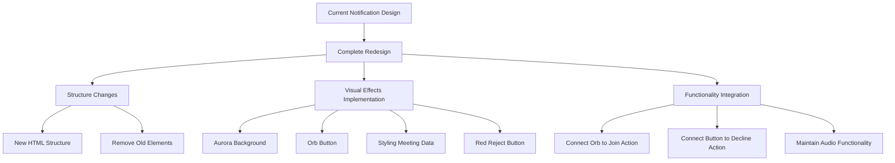

# Notification Redesign Implementation Plan

## Overview

This document outlines the plan for redesigning the Google Meet Reminder notification window with a modern, visually appealing interface featuring a black background with aurora effect, an orb-based join button, and a red reject button.

## Design Requirements

1. **Visual Elements**:
   - Black background with aurora effect (inspired by https://www.reactbits.dev/backgrounds/aurora)
   - Orb element as the main join button (inspired by https://www.reactbits.dev/backgrounds/orb)
   - Meeting data (title and time) displayed above the orb
   - Red reject button below the orb

2. **Functionality**:
   - Maintain all existing functionality while updating the visual design
   - Orb should be clickable and function as the "Join" button
   - Red button should function as the "Decline" button
   - Meeting title and time should be displayed prominently
   - Audio functionality should be preserved

## Implementation Plan

### 1. Structure Changes

#### 1.1 HTML Structure Update
Replace the current notification.html structure with a new layout featuring:
- Canvas elements for the aurora background and orb effects 
- Container for meeting data (title and time) above the orb
- Text overlay for the "Join" text within the orb
- Red reject button below the orb

#### 1.2 CSS Restructuring
- Create styles for the black background
- Position the aurora effect to cover the entire background
- Style the meeting data to be visible against the aurora background
- Style the orb container and text overlay
- Style the red reject button

### 2. WebGL Implementation

#### 2.1 Aurora Background
- Adapt the WebGL shader code from the provided React example
- Create a dedicated Aurora class for improved animation
- Implement customizable color stops (purple, pink, red gradient)
- Add configurable animation parameters (blend, amplitude, speed)
- Create fluid motion with improved WebGL shaders

#### 2.2 Orb Implementation
- Implement a dedicated Orb class for improved animation
- Add interactive hover effects with rotation and distortion
- Add customizable hue and hover intensity parameters
- Implement smooth transitions and fluid motion
- Position "Join" text in the center of the orb

### 3. JavaScript Functionality

#### 3.1 Maintain Core Functionality
- Keep the URL parameter parsing for meeting details
- Maintain the ringtone functionality
- Preserve the message sending to background script for join/decline actions

#### 3.2 New Interactions
- Connect orb click to the existing handleJoinClick function
- Connect red button click to the existing handleDeclineClick function
- Add WebGL initialization and animation loop
- Add fallbacks for browsers that don't support WebGL

## Files to be Modified

1. **notification.html**
   - Complete restructuring with new elements

2. **notification.css**
   - Complete redesign of styles
   - New animation and visual effect styles

3. **notification.js**
   - Add WebGL initialization and animation
   - Maintain existing functionality while adapting to new UI elements

## Implementation Challenges and Solutions

### Challenge 1: Background Script Limitations
Background scripts in Chrome extensions have certain limitations:
- Cannot access window.screen properties directly
- Some chrome.windows.create() options are not supported

Solutions:
- Use chrome.system.display API to dynamically detect screen dimensions
- Add fallback to Full HD (1920x1080) dimensions if API is unavailable
- Remove unsupported properties (titlePreface, setSelfAsOpener) from the chrome.windows.create() options

### Challenge 2: WebGL Adaptation
Converting the React components to vanilla JavaScript will require:
- Extracting the shader code
- Creating a dedicated Aurora class to encapsulate the animation logic
- Implementing customizable parameters for the aurora effect
- Setting up WebGL contexts and animation loops manually

### Challenge 2: Event Handling
Since we're replacing standard buttons with WebGL elements:
- We'll need to use the orb container as a clickable element
- Add event listeners to the canvas or its container
- Ensure proper hover states and visual feedback on interaction

### Challenge 3: Performance
WebGL effects can be resource-intensive:
- Implement throttling for animation frames
- Add fallbacks for devices that don't support WebGL
- Ensure the notification window doesn't cause performance issues

## Testing Strategy
1. Test in different browsers and screen sizes
2. Verify all functionality works with the new UI
3. Test audio playback with the new design
4. Ensure proper cleanup of WebGL resources when the notification is closed
5. Test fallback behavior for browsers that don't support WebGL

## Next Steps

After implementing the redesign:
1. Test thoroughly to ensure all functionality works as expected
2. Update documentation to reflect the new design
3. Consider additional improvements based on user feedback