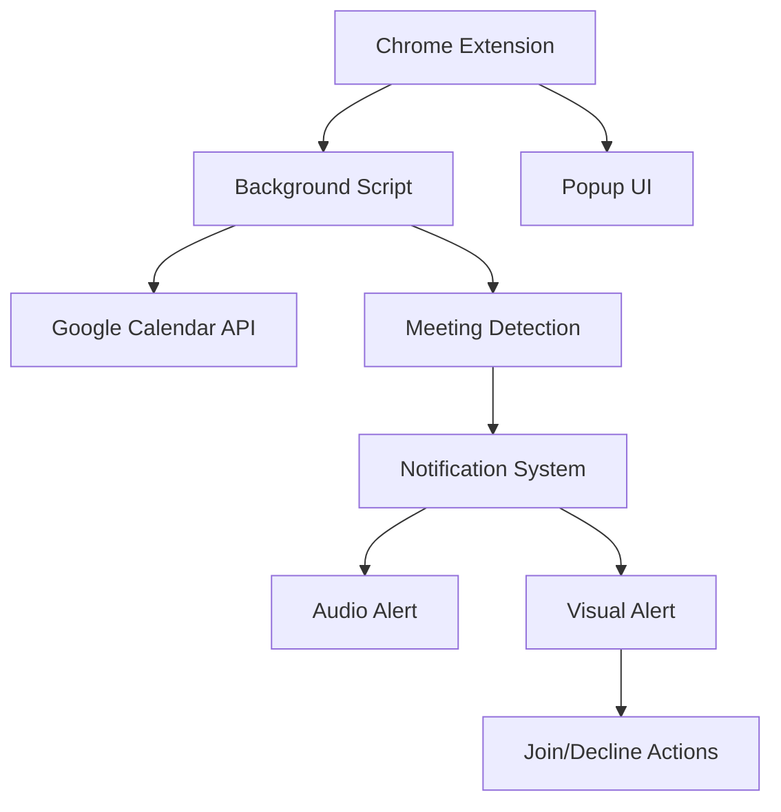

# Google Meet Reminder Extension

## Overview
My name is Laszlo A. Toth (LavX). My url is https://lavx.hu, github repo https://github.com/lavx/googlechatnotifier
This Chrome extension will connect to Google Calendar, detect scheduled Google Meet calls, and provide aggressive reminders at the exact meeting time with:
- A popup showing meeting details at the exact meeting time
- Continuous playback of the provided ringtone until action is taken
- "Join" and "Decline" buttons
- Automatic opening of the Google Meet link in a new tab when "Join" is clicked

## System Architecture

## Technical Components

1. **Extension Structure**
   - manifest.json: Configuration file defining permissions and components
   - background.js: Service worker for calendar integration and meeting detection
   - popup.html/js: Simple UI for extension status
   - notification.html/js/css: Custom notification UI for meeting alerts
   - assets: Icons and sound files (already provided)

2. **Google Calendar Integration**
   - Use Google Calendar API with OAuth2
   - Schedule periodic checks for upcoming meetings

3. **Meeting Detection System**
   - Parse Google Calendar events
   - Identify events with Google Meet links
   - Schedule alerts at exact meeting times

4. **Notification System**
   - Custom HTML notification showing meeting details
   - Continuous ringtone playback
   - Join/Decline action buttons

5. **Action Handlers**
   - Join: Extract and open Google Meet URL in new tab
   - Decline: Close notification and stop audio

## Implementation Approach

1. Set up basic extension structure with required permissions
2. Implement Google Calendar API integration with OAuth2
3. Create meeting detection logic to find Google Meet events
4. Build custom notification UI with audio capabilities
5. Implement action handlers for Join/Decline buttons
6. Test and package the extension