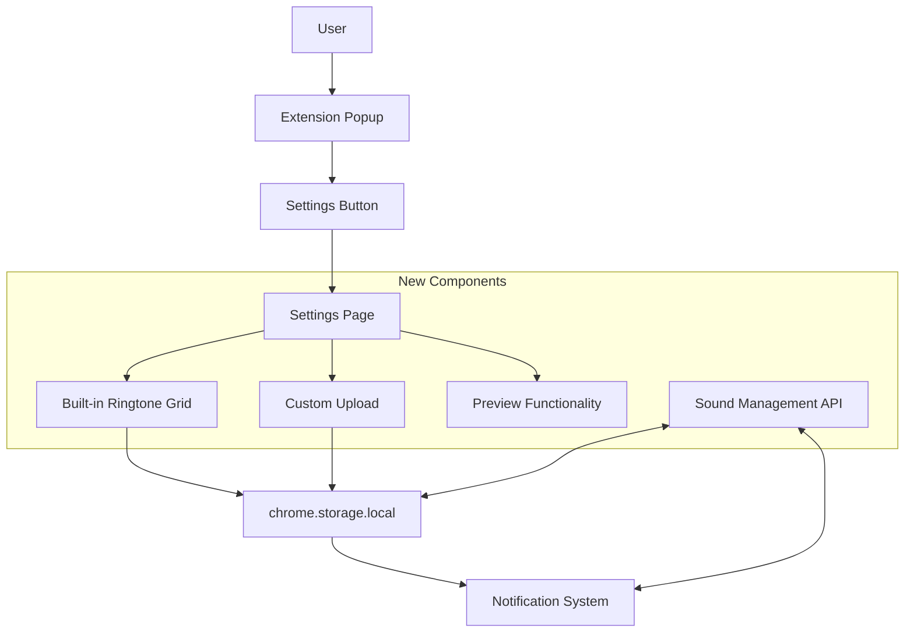
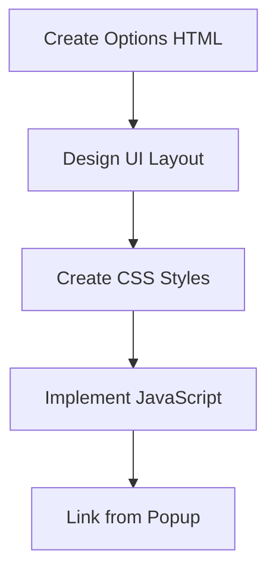
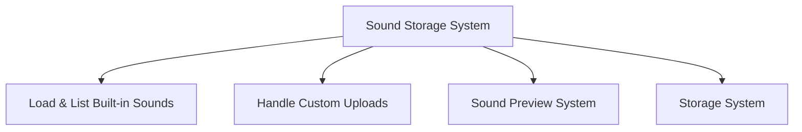
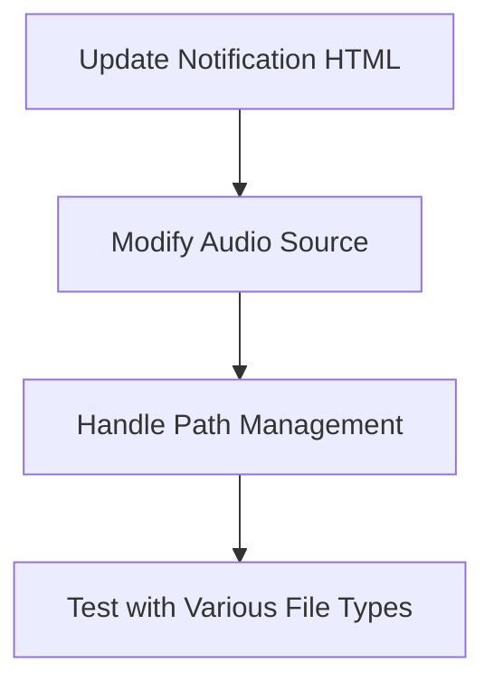
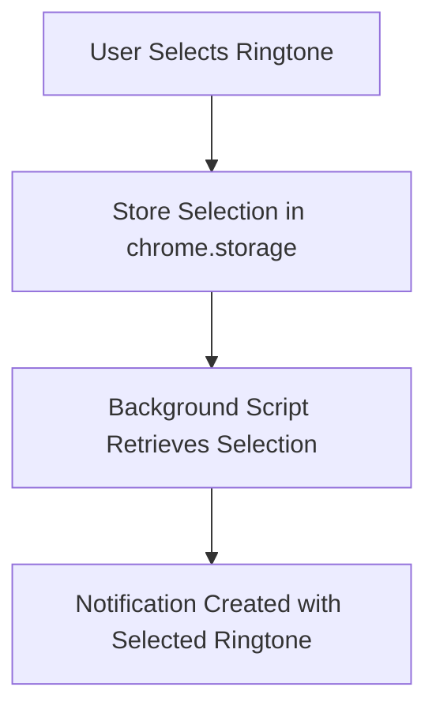

# Ringtone Selection Feature Implementation Plan

## Overview

This plan outlines the implementation of a ringtone selection feature for the Google Meet Reminder extension, allowing users to:

1. Select from built-in ringtones (removing the "Grace UX" prefix for display)
2. Upload custom .mp3 or .ogg sound files
3. Preview sounds before selecting
4. Have their choice persist across browser sessions

## Architecture Changes

## Implementation Steps

### 1. Create Settings Page Structure

1. **Create Options Page Files**
   - Create `options/options.html` with a clean, modern design
   - Create `options/options.css` for styling
   - Create `options/options.js` for logic
   - Register the options page in manifest.json

2. **Design UI Layout**
   - Header with title and description
   - Grid layout for ringtone choices (with visual indicators)
   - File upload section with clear instructions
   - "Save" and "Reset to Default" buttons
   - Preview mechanism (play/stop buttons)

### 2. Sound Management System

1. **Sound Storage System**
   - Create a `storage-manager.js` module to handle sound-related storage
   - Define structure for storing ringtone preferences
   - Implement functions for loading/saving preferences

2. **Sound Listing Functionality**
   - Scan assets directory for available sounds 
   - Remove "Grace UX" prefix for display names
   - Create visual elements for each sound option
   - Add selection highlighting

3. **Custom Upload Functionality**
   - Implement file input with validation (.mp3 and .ogg only)
   - Handle file reading and conversion to data URL
   - Add uploaded sounds to the options grid
   - Implement size limits and validation (ChromeOS compatibility)

4. **Preview Functionality**
   - Create audio control system to play selected sound samples
   - Add play/stop buttons to each sound option
   - Ensure only one sound plays at a time
   - Include volume control

### 3. Integration with Notification System

1. **Update Notification HTML**
   - Modify the audio element to use dynamic source path

2. **Update Background Script**
   - Add functions to retrieve the selected ringtone path
   - Pass the ringtone path to the notification window
   - Handle fallback to default if selected sound isn't available

3. **Notification Script Updates**
   - Modify notification.js to accept and use the specified ringtone
   - Add error handling for missing or invalid sound files

### 4. Data Flow and Storage

1. **Storage Structure**
   - Store ringtone selection in chrome.storage.local with a key like "ringtone_preference"
   - For built-in sounds, store the file path
   - For custom uploads, store as data URL or in chrome.storage.local

2. **Data Persistence**
   - Ensure ringtone choice persists across browser restarts
   - Include validation when loading to handle missing files

## Technical Considerations

1. **File Size and Storage Limits**
   - Implement maximum file size for uploads (e.g., 2MB)
   - Handle chrome.storage.local limits (5MB total)
   - Add cleanup mechanism for unused uploaded sounds

2. **URL Handling**
   - Use chrome.runtime.getURL() for accessing built-in sounds
   - Use data URLs or object URLs for custom uploads
   - Handle permissions for accessing files

3. **Format Compatibility**
   - Test playback compatibility across browsers
   - Add format validation for uploads
   - Provide clear error messages for incompatible files

4. **Performance**
   - Optimize audio loading to prevent notification delays
   - Cache sound files when possible
   - Implement efficient preview mechanism

## UI Design

1. **Settings Page Layout**
   - Clean, modern design consistent with extension
   - Card-based grid for sound options
   - Clear visual indication of current selection
   - Accessible controls with keyboard navigation

2. **Sound Display Cards**
   - Sound name (with "Grace UX" prefix removed)
   - Play/preview button
   - Visual selection indicator
   - Subtle hover effects

3. **Upload Section**
   - Drag-and-drop area with clear instructions
   - File type indicators (.mp3, .ogg)
   - Progress indicator for uploads
   - Clear error messaging

## Testing Plan

1. **Functionality Testing**
   - Test selection and persistence of built-in sounds
   - Test upload and selection of custom sounds
   - Test preview functionality
   - Test integration with notification system

2. **Edge Cases**
   - Test with very short/long sound files
   - Test with corrupted audio files
   - Test with extremely large files
   - Test with files that have unusual metadata

3. **Cross-Browser Compatibility**
   - Test in Chrome, Edge, and other Chromium browsers
   - Test on different operating systems

## Implementation Files

1. **New Files**
   - `options/options.html` - Options page HTML
   - `options/options.css` - Options page styling
   - `options/options.js` - Options page logic
   - `js/storage-manager.js` - Sound storage management module

2. **Files to Modify**
   - `manifest.json` - Add options page registration
   - `notification/notification.html` - Update audio source
   - `notification/notification.js` - Handle dynamic ringtone
   - `background/background.js` - Pass ringtone path to notification
   - `popup/popup.html` - Add settings link
   - `popup/popup.js` - Add handler for settings link