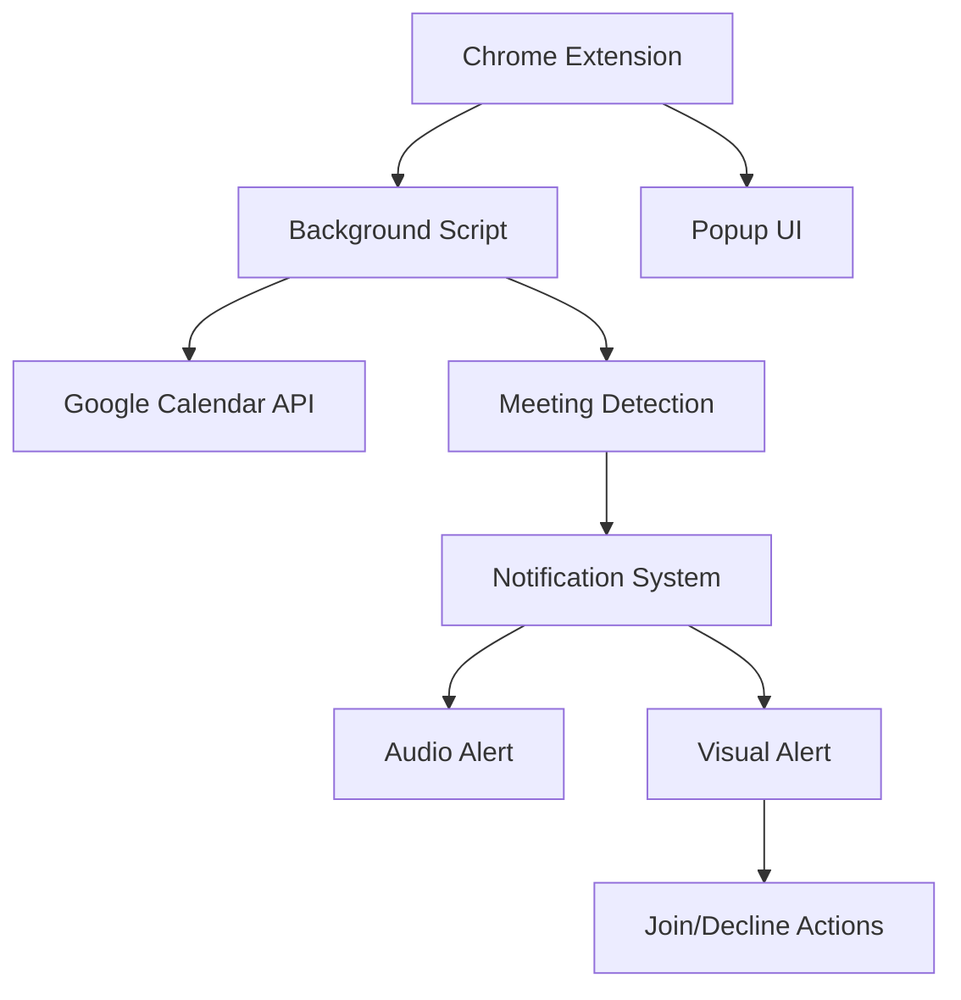
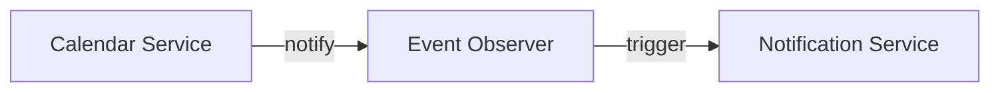
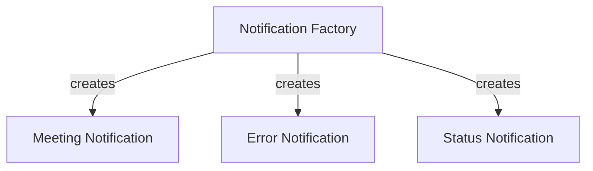

# Google Meet Reminder Extension - System Patterns

## System Architecture

The Google Meet Reminder Extension follows a modular architecture with clear separation of concerns to maintain a maintainable and extensible codebase.

## Key Technical Decisions

### 1. Background Service Worker

We've chosen to use Chrome's service worker approach for the background script rather than the deprecated background page. This provides better performance and follows modern Chrome extension best practices.

**Rationale:** Service workers are more efficient and maintain a minimal memory footprint when inactive.

### 2. Custom Notification UI

Rather than using Chrome's native notification API, we're implementing a custom HTML-based notification system.

**Rationale:** 
- Chrome's native notifications have limitations in terms of persistent audio playback
- Custom HTML notifications allow for more control over styling and user interaction
- We can implement continuous audio playback until user action

### 3. Calendar Integration Approach

We'll use the Google Calendar API with OAuth2 authentication to access calendar data.

**Rationale:**
- Provides secure, permissioned access to user's calendar
- Allows reading calendar events without exposing sensitive user data
- More reliable than trying to scrape calendar data from the UI

### 4. Audio Implementation

We'll use the Web Audio API for playing the ringtone continuously until user interaction.

**Rationale:**
- Provides better control over audio playback than HTML audio elements
- Allows for audio loops without gaps between repetitions
- Can be precisely controlled based on user actions

## Design Patterns

### 1. Observer Pattern

The extension will use the observer pattern to monitor calendar events and trigger notifications.

### 2. Factory Pattern

A notification factory will be used to create appropriate notification objects based on meeting types.

### 3. Singleton Pattern

Key services like the Calendar API client and Audio Manager will be implemented as singletons to ensure consistent state.

## Component Relationships

### Background Script Responsibilities

The background script serves as the central coordinator:
- Maintains authentication state
- Periodically checks calendar events
- Schedules meeting notifications
- Manages audio playback
- Handles user actions from notifications

### Notification Component Responsibilities

The notification component:
- Displays meeting information
- Plays ringtone sound
- Provides Join/Decline options
- Communicates user choices back to background script

### Google Calendar API Client

The Calendar API client:
- Handles OAuth2 authentication flow
- Fetches upcoming calendar events
- Parses Google Meet URLs from event details
- Converts event times to appropriate formats

### Audio Manager

The Audio Manager:
- Loads and caches audio assets
- Controls playback of ringtone
- Manages audio states (play, pause, stop)
- Adjusts volume if needed